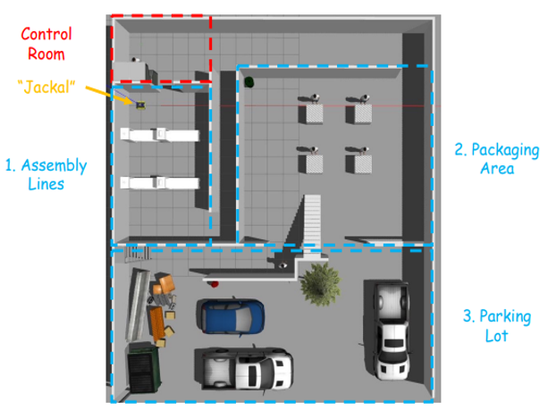
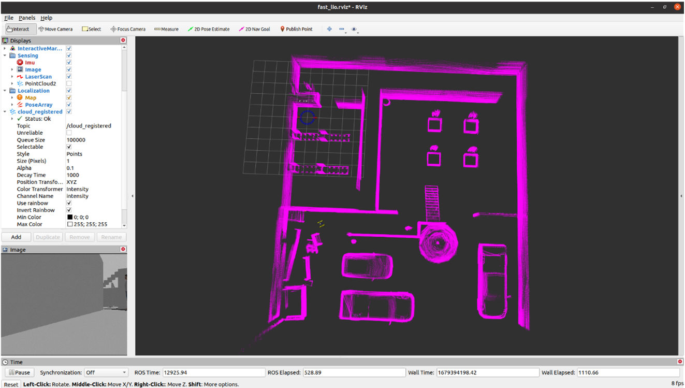
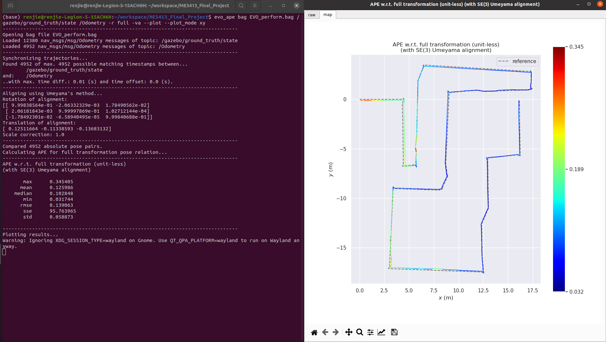
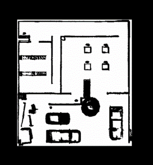
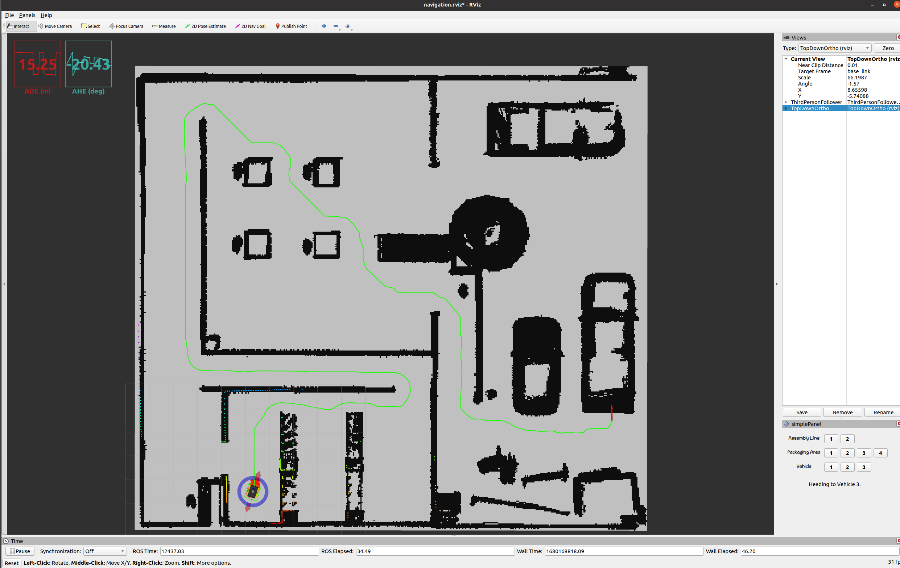

# Autonomous Mobile Robot Mapping & Navigation in Virtual Factory


This is the **ME5413 Autonomous Mobile Robotics @ NUS** Final Project finished by Group18

Please consider referring to original readme of original project provided: [Porject README Link](project_intro/README.md)



## 1. Project Decription
A mini-factory environment provided in Gazebo. 
* 3 accessible areas
* 1 inaccessible area

The **aim** of the project is to design a robot navigation software stack that :  
* From the starting point, move to the given pose within each area in sequence:
  * Assembly Line 1, 2
  * Packaging Area 1, 2, 3, 4
  * Delivery Vehicle 1, 2, 3

Two main tasks included: **Mapping** & **Navigation**

**Files included:**
* Report: Group18_FinalProject.pdf
* PPT: Presentation.pptx
* Video Recording: one **Video_Uncompressed.mp4** file available in: [Google Drive Link](https://drive.google.com/file/d/1lj-83mchuxrjdUUB504Vcz-bM367FJpr/view?usp=share_link)
* Map file: 
  1) one 2D projection map file **map.pgm**
  2) one 3D pointcloud mapping file **map_pointcloud.pcd** available in :[Google Drive Link](https://drive.google.com/file/d/19SF8SPli2iWed0avGKpOY63t1eXppWkJ/view?usp=share_link)

## 2. Prerequisites
### 2.1 **Ubuntu** and **ROS**
* Ubuntu >= 18.04
* ROS    >= Melodic. [ROS Installation](http://wiki.ros.org/ROS/Installation)

### 2.2 **PCL && Eigen**
* PCL    >= 1.8,   Follow [PCL Installation](http://www.pointclouds.org/downloads/linux.html).
* Eigen  >= 3.3.4, Follow [Eigen Installation](http://eigen.tuxfamily.org/index.php?title=Main_Page).

### 2.3 **livox_ros_driver**
* Follow [livox_ros_driver Installation](https://github.com/Livox-SDK/livox_ros_driver).

*Remarks:*
- **livox_ros_driver** must be installed and **sourced** as FAST-LIO must support Livox serials LiDAR firstly.
- How to source? Add the line `source $Licox_ros_driver_dir$/devel/setup.bash` to the end of file `~/.bashrc`, where `$Licox_ros_driver_dir$` is the directory of the livox ros driver workspace (should be the `ws_livox` directory if you completely followed the livox official document).

### 2.4 robot-pose-ekf
```
sudo apt-get install ros-noetic-robot-pose-ekf
```

### 2.5 navigation global_planner
```
sudo apt-get install ros-noetic-navigation
```

### 2.6 folder to be created
create a folder named `include` in`src/aster_ws/src/Astar_planner`. And an empty folder named `astar_planner` in it.

## 3. Execution
### Part 1 Mapping
#### 3.1.1 Build
```
cd ~/ME5413_Mobile_Robot_Mapping_Navigation
catkin_make

cd ~/ME5413_Mobile_Robot_Mapping_Navigation/src/FAST_LIO_
mkdir PCD
```

#### 3.1.2 Run FAST-LIO
```
# First terminal
source devel/setup.bash
roslaunch me5413_world world.launch

# Second terminal
source devel/setup.bash
roslaunch me5413_world fast_lio.launch
```


#### 3.1.3 EVO evaluation
```
# Third  terminal (rosbag for EVO)
cd ~/ME5413_Mobile_Robot_Mapping_Navigation/EVO
rosbag record /gazebo/ground_truth/state /Odometry -o EVO_perform.bag
```
After doing mapping, pointcloud `scans.pcd` will save in `src/FAST_LIO_/PCD/`   
Using EVO to evaluate the mapping performence : `evo_ape bag EVO_perform.bag /gazebo/ground_truth/state /Odometry -r full -va --plot --plot_mode xy`



#### 3.1.4 Convert pcd pointcloud to grid map

Firstly, change the filepath in `pcdtomap.launch` to your own path (in the `src/pcdtomap/launch/`)
```
# One terminal
source devel/setup.bash
roslaunch pcdtomap pcdtomap.launch

# Another terminal
cd ~/ME5413_Mobile_Robot_Mapping_Navigation/src/pcdtomap/map/
rosrun map_server map_saver
```
The pointcloud file after filtering `map_radius_filter.pcd` is saved in `src/FAST_LIO_/PCD/`   
The grid map file `map.pgm` and `map.yaml` is saved in `src/pcdtomap/map/`   
We backup copy the good result in the `/backup` folder



### Part 2 Navigation
#### 3.2.1 Build
```
cd ~/ME5413_Mobile_Robot_Mapping_Navigation
catkin_make
```
*Remarks:*
1. Uncomment corresponding algorithm you want to use in `src/me5413_world/launch/move_base.launch`
2. The parameters of planning algorithms and costmap are in corresponding `params` files.
3. For localization, **amcl**, **ekf_template** and **robot_pose_ekf** had been used. Then, the global planner has three choice can be select, finally, the local planner has two method had been provide. Pick the corrspending choice and comment specific command in those files can implement them.

#### 3.2.2 Run navigation
```
# First terminal
source devel/setup.bash
roslaunch me5413_world world.launch

# Second terminal
source devel/setup.bash
roslaunch me5413_world navigation.launch
```
Choose corresponding topic in `global path` and click the button in `simplePanel` to select the goal pose.



## Acknowledge

This project is finished from **NUS ME5413 Autonomous Mobile Robotics**

Many Thanks to **Professor. Marcelo** and **Ph.D. Candidate Shuo SUN** @ NUS Advanced Robotics Centre
